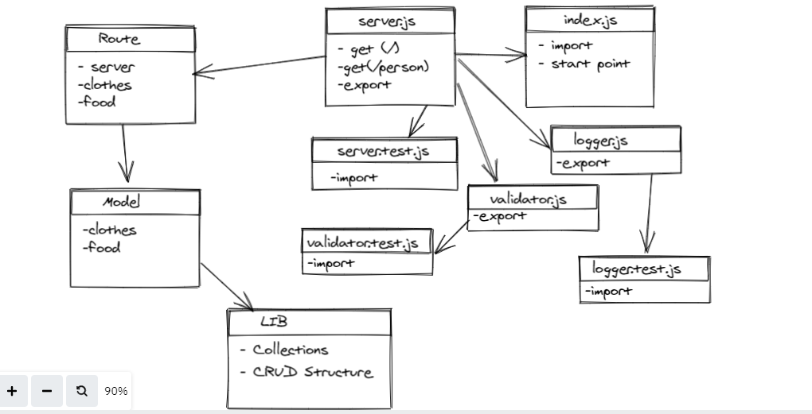

# basic-api-server

## LAB -03

### Deployment Test

- [ci/cd GitHub Actions](https://github.com/MohammadAljadayh/api-server/actions).
- [herokuapp Link Main ](https://apiservermohammad.herokuapp.com/).
- [pull request](https://github.com/MohammadAljadayh/api-server/pull/1).
- [Main Repo link](https://github.com/MohammadAljadayh/api-server).

## Setup 

`.env` **requirements**

- `PORT` - 3000

- `POSTGRES_URI` = Postgres DB

**Running the app**

- `npm start` , `nodemon` 

- Endpoint: `/food/1`

  - Returns Object

        {
        "foodName": "mansaf",
        "country" : "jordan" 
        }

- Endpoint: `/clothes/1`

  - Returns Object

        {
  clothesName: "addidas",
    color: "red",
  };
        }

**Tests**

- Unit Tests: `npm run test`

---------------------------------------------------------
UML : 

